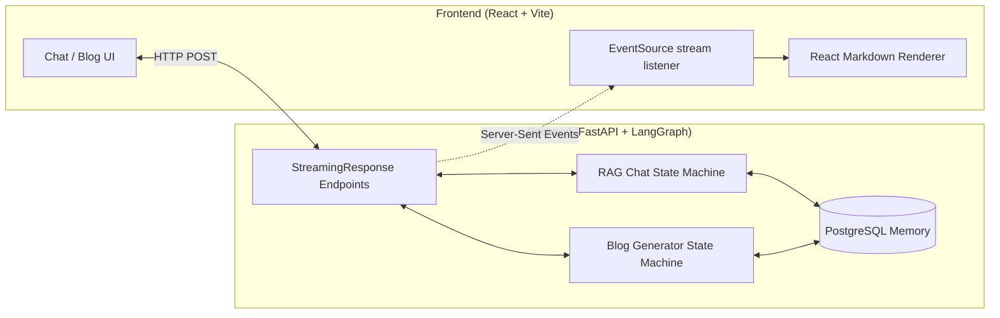

# Agentic AI ChatBot & Blog Generator

Welcome to the **Agentic AI ChatBot & Blog Generator** repository! This project is a full-stack, highly scalable AI application designed to showcase advanced LLM orchestration, retrieval, and multi-agent workflows. 

This repository is split into two primary components, each with its own detailed documentation:
- **[Backend Architecture & Workflows](./backend/README.md)** (FastAPI, LangGraph, FAISS)
- **[Frontend UI & Streaming](./frontend/README.md)** (React, Vite, Server-Sent Events)

## 🎬 Demo

<video src="./frontend/public/demo.mp4" controls="controls" width="100%" style="max-width: 100%; border-radius: 8px;" autoplay loop muted>
  Your browser does not support the video tag. You can view the demo video directly at <a href="./frontend/public/demo.mp4">frontend/public/demo.mp4</a>.
</video>

## 🌟 Key Features

### 1. Hybrid Search (FAISS + BM25)
A highly accurate Retrieval-Augmented Generation (RAG) system utilizing an `EnsembleRetriever`. By combining dense semantic search (FAISS) with sparse keyword matching (BM25) via Reciprocal Rank Fusion (RRF), the chatbot excels at both conceptual queries and exact term matching.

### 2. Multi-Agent Blog Generation (Map-Reduce)
An autonomous blogging pipeline that performs web research (Tavily), orchestrates an SEO-optimized content plan, and utilizes a **Fan-Out/Fan-In** architecture. It dynamically spawns parallel worker agents to write independent blog sections simultaneously, drastically reducing generation time and preventing LLM context-window degradation.

### 3. Automated Image Generation
During the blog generation workflow, a reducer subgraph analyzes the final text, strategically decides where diagrams/visuals are needed, and automatically generates them using the **Cloudflare Workers AI** image models, placing them inline using Markdown.

### 4. Dual-Memory System (STM & LTM)
Powered by LangGraph and PostgreSQL:
- **Short-Term Memory (STM):** Conversation threads are saved via `AsyncPostgresSaver` checkpointers, allowing seamless resumption of specific chats.
- **Long-Term Memory (LTM):** Cross-thread user profiles and persistent facts are stored globally via `AsyncPostgresStore`, allowing the agent to "remember" user preferences across entirely new sessions.

### 5. Multi-Layer Guardrails & Self-Correction
The backend employs a complex State Machine that proactively intercepts malicious prompts and filters NSFW content. Generated outputs undergo strict hallucination checks (are they supported by the retrieved facts?) and usefulness evaluations. If an output fails, the agent autonomously loops back to revise its answer or rewrite the search query.

## 🏗 High-Level Architecture



## 🚀 Quick Start

### Prerequisites
- Python 3.10+
- Node.js (v18+)
- API Keys: Gemini, Tavily, Cloudflare (for Image Gen)
- A running instance of PostgreSQL

### 1. Backend Setup
```bash
cd backend
python -m venv venv
source venv/bin/activate  # On Windows: .\venv\Scripts\activate
pip install -r req.txt

# Create a .env file and add your API keys
# Run the FastAPI server
uvicorn api:app --reload
```

### 2. Frontend Setup
```bash
cd frontend
npm install

# Run the Vite dev server
npm run dev
```

## 📚 Deep Dive Documentation

For a deep dive into the specific algorithms, state machines, and technical decisions made in this project (highly recommended for technical interviews), please read the specific component READMEs:

👉 **[Read the Backend Documentation](./backend/README.md)**  
👉 **[Read the Frontend Documentation](./frontend/README.md)**
