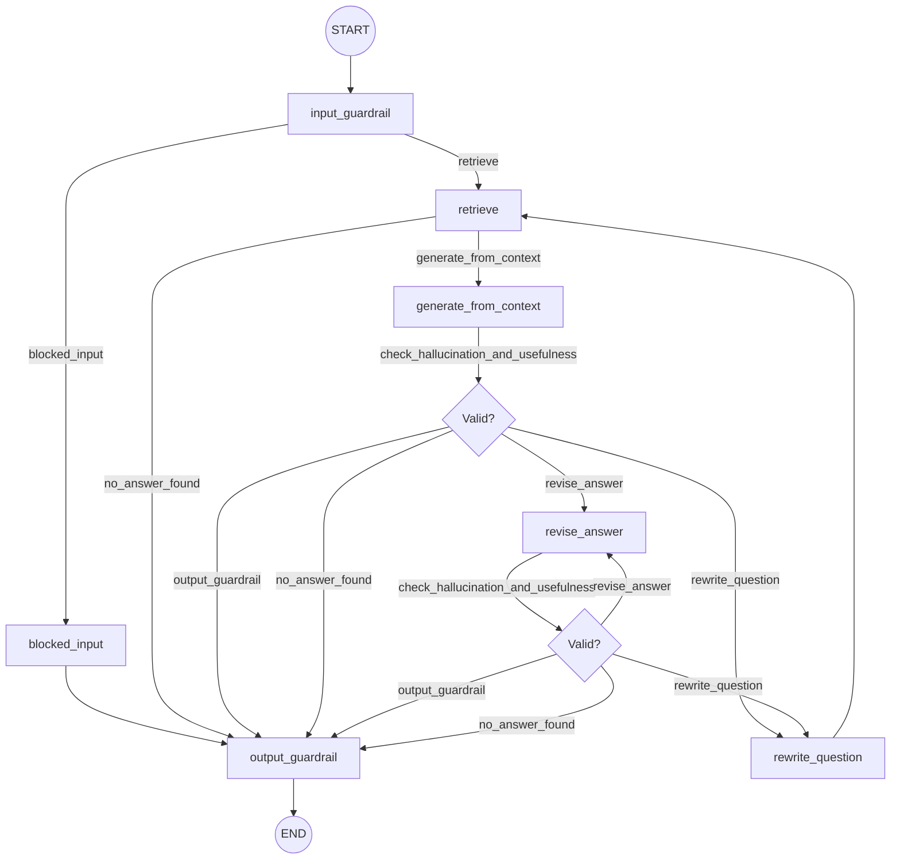
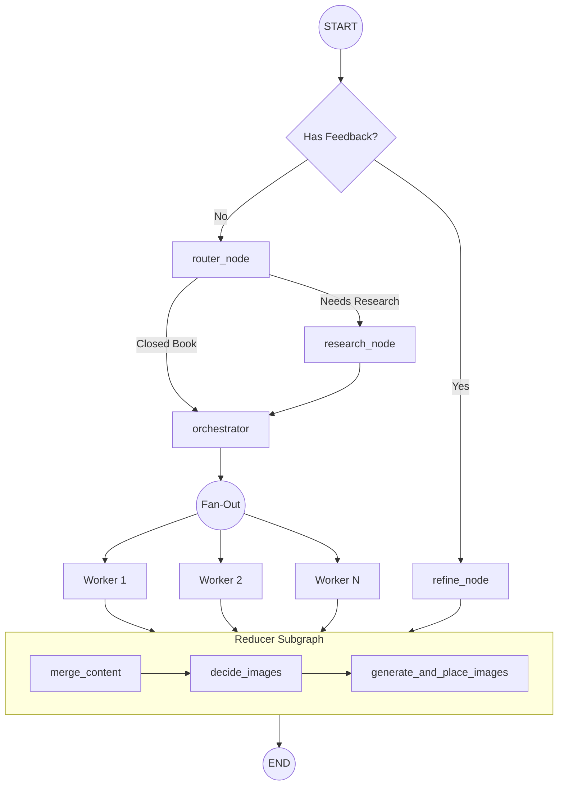

# Agentic RAG ChatBot & Blog Generator - Backend

## 1. Project Overview (Elevator Pitch)
The backend of this project is a robust, highly modular AI application powered by **LangGraph** and **FastAPI**. It serves two primary workflows: 
1. **A fully agentic Retrieval-Augmented Generation (RAG) Chatbot** that intelligently retrieves documents, guards against malicious inputs, and self-corrects hallucinations.
2. **An automated, multi-agent Technical Blog Generator** that performs web research, orchestrates a content plan, parallelizes the writing process using a Map-Reduce (Fan-out/Fan-in) architecture, and automatically generates/places context-aware images into a polished Markdown document.

## 2. Tech Stack & Justification
- **FastAPI:** Chosen for its asynchronous, high-performance nature, allowing seamless handling of Server-Sent Events (SSE) for streaming LLM responses to the frontend.
- **LangGraph:** Chosen over standard linear chains because it natively supports cyclic state machines (for self-correction loops) and Map-Reduce architectures (for spawning parallel workers).
- **LangChain:** Used for its rich ecosystem of document loaders (PyPDFLoader), vector stores, prompt templates, and output parsers.
- **FAISS & BM25 (Hybrid Search):** FAISS provides rapid semantic search, while BM25 handles sparse keyword matching.
- **PostgreSQL:** Used via `AsyncPostgresSaver` for persistent checkpoints, enabling the graph to resume state and remember chat history.
- **Gemini 3.5 Flash Lite API:** Chosen for its high-speed generation, strong reasoning capabilities, and large context window.
- **Tavily Search API:** Chosen as a dedicated, low-latency search engine API optimized for autonomous LLM research.
- **Cloudflare Workers AI:** Used for high-quality, fast text-to-image generation for the blog posts.

## 3. Architecture & End-to-End Workflows

The backend operates via two primary LangGraph State Machines.

### 3.1. ChatBot RAG Workflow (`rag.py`)

This workflow governs the interactive chatbot. It is designed with safety, accuracy, and self-reflection at its core.

**Step-by-step Flow:**
1. **Input Guardrail:** An LLM acts as a firewall, checking for prompt injections, hacking attempts, or NSFW content.
2. **Hybrid Retrieval:** A FAISS vector store fetches dense matches, while BM25 fetches keyword matches. An `EnsembleRetriever` merges them using Reciprocal Rank Fusion (RRF).
3. **Context Evaluation (`is_relevant`):** An LLM grades the retrieved documents. If they lack relevance, the graph routes to `no_answer_found`.
4. **Generation & Verification:** The system generates an answer based on the context.
5. **Self-Correction (`check_hallucination_and_usefulness`):** The output is graded twice:
   - *Hallucination Check:* Ensures the generation is strictly supported by the retrieved facts. If not, it routes to `revise_answer`.
   - *Usefulness Check:* Ensures the generation actually answers the user's prompt. If not, it routes to `rewrite_question` to fetch better context.
6. **Output Guardrail:** The verified response passes through a final check to ensure professional tone and compliance.

---

### 3.2. Automated Blog Generation Workflow (`blog.py`)

This workflow generates deep, researched technical blogs using a Map-Reduce architecture to massively speed up writing time and improve quality.

**Step-by-step Flow:**
1. **Entry Router:** Checks if the user is providing feedback on an existing draft. If yes, it routes to `refine_node` to update the document. Otherwise, it starts a new blog via `router_node`.
2. **Router & Research:** The router decides if the topic needs live web context (open-book) or can rely on internal model knowledge (closed-book). If research is needed, `research_node` uses Tavily Search to gather and deduplicate evidence.
3. **Orchestrator:** An SEO-specialist LLM creates a structured `Plan` containing a blog title and multiple specific `Task` objects (representing blog sections like Intro, Body, Conclusion).
4. **Fan-Out (Workers):** Using LangGraph's `Send` API, the graph spawns independent `worker` nodes in parallel for each section defined in the plan. Each worker writes its assigned section simultaneously.
5. **Reducer Subgraph (Fan-In):**
   - `merge_content`: Waits for all workers to finish, sorts the sections by ID, and stitches them into a single Markdown document.
   - `decide_images`: Analyzes the merged draft and strategically inserts placeholders (e.g., `[[IMAGE_1]]`) where diagrams or visuals would aid understanding.
   - `generate_and_place_images`: Calls Cloudflare Workers AI to generate PNG files for the placeholders, saves them to the filesystem, and embeds standard Markdown image links into the final document.

## 4. Core Mechanics & Algorithms

### Reciprocal Rank Fusion (RRF) for Hybrid Search
In the Chatbot workflow, pure semantic search (FAISS) often struggles with exact keyword matches (like specific IDs or acronyms). To fix this, an `EnsembleRetriever` fuses dense vectors (FAISS) and sparse vectors (BM25) by applying weights (70% Semantic, 30% BM25). It calculates a combined score for each document using the RRF formula: `Score = sum(weight / (k + rank))`, ensuring documents scoring highly in *both* keyword and semantic metrics rise to the top.

### Parallel Map-Reduce (Fan-out/Fan-in)
In the Blog workflow, asking a single LLM call to write a 1,500-word blog often results in repetitive, shallow content and takes over 30 seconds. 
By utilizing LangGraph's `Send` API, the `fanout` node dynamically spawns identical parallel sub-processes (Workers). Each worker only focuses on writing 300 words for its specific sub-topic. This massively reduces wall-clock execution time and dramatically improves the depth and quality of the final article, as the LLM's context window isn't stretched thin over a massive output generation.

### State & Memory Management (STM & LTM)
A truly agentic system requires memory to maintain context and persist data. This architecture utilizes a dual-memory approach using LangGraph's native PostgreSQL integrations:
- **Short-Term Memory (STM) via Checkpointers:** Managed via the `AsyncPostgresSaver` checkpointer. Every time a node completes, the exact state of the graph is serialized and saved to PostgreSQL under a unique `thread_id`. This acts as the agent's short-term memory, allowing the chatbot to "remember" the immediate context of a specific conversation and seamlessly resume interrupted workflows.
- **Long-Term Memory (LTM) via Stores:** Managed via the `AsyncPostgresStore` (`BaseStore`). Unlike STM which is isolated to a single thread/conversation, Stores allow the agent to persist and recall cross-thread memories. This enables the bot to build a long-term profile of the user, remembering preferences, past facts, or historical interactions that persist globally across entirely new chat sessions.
